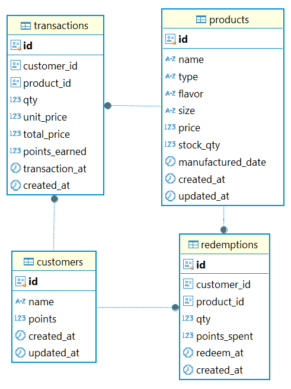
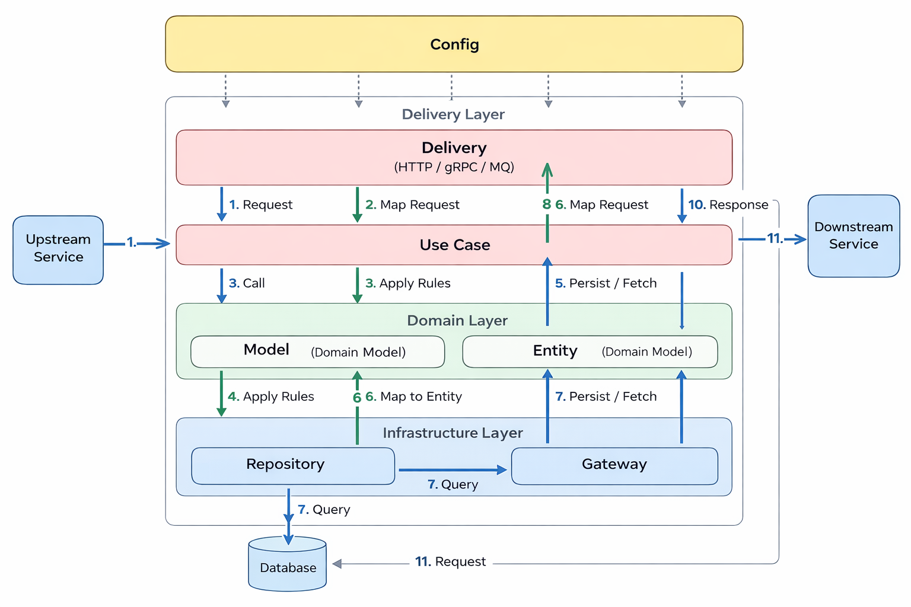

# Snack Store API

REST API untuk **Produk**, **Transaksi Pembelian**, **Penukaran Poin**, dan **Laporan Transaksi** untuk toko snack.

> Base path: `/api` (tanpa versioning).

---

## Daftar Isi

- [Fitur](#fitur)
- [Tech Stack](#tech-stack)
- [Diagram](#diagram)
- [Quick Start](#quick-start)
  - [Jalankan dengan Docker](#jalankan-dengan-docker)
  - [Jalankan secara Local](#jalankan-secara-local)
- [Flag CLI](#flag-cli)
- [Environment Variables](#environment-variables)
- [Database](#database)
- [API](#api)
  - [Daftar Endpoint](#daftar-endpoint)
  - [Contoh Request](#contoh-request)
  - [Pagination](#pagination)
- [Caching (Redis)](#caching-redis)
- [Rate Limiting](#rate-limiting)
- [Definisi Report](#definisi-report)
- [Postman Collection](#postman-collection)
- [OpenAPI / Swagger](#openapi--swagger)
- [Tests](#tests)
- [Lisensi](#lisensi)

---

## Fitur

- Produk: tambah produk dan lihat produk berdasarkan tanggal pembuatan.
- Transaksi: tambah transaksi pembelian (auto-create customer jika belum ada), hitung poin, kurangi stok.
- Customer: view daftar customer dan poin (tanpa CRUD customer).
- Redeem: tukar poin untuk produk sesuai ukuran.
- Report: ringkasan transaksi periode (income, best seller, total terjual, transaksi terakhir, indikator customer baru).
- Redis: cache produk per tanggal & cache report periode + invalidasi, serta dipakai untuk rate limiting.

---

## Tech Stack

- Go
- Gin
- PostgreSQL
- Redis

---

## Diagram

**ERD / Database Schema**



**Arsitektur Backend**



---

## Quick Start

### Jalankan dengan Docker (paling cepat)

```bash
docker compose up --build
```

Default base URL:

- `http://localhost:8080`

> Catatan: compose biasanya menjalankan server + proses setup sesuai konfigurasi project (migrate/seed/run).

### Jalankan secara Local

1. Salin env:

```bash
cp .env.example .env
```

2. Jalankan server (contoh dengan migrate + seed + run):

```bash
go run ./cmd/web --drop-table --migrate --seed --run
```

3. Jalankan server saja (jika DB sudah siap):

```bash
go run ./cmd/web
```

4. Hot reload (jika menggunakan air):

```bash
air
```

---

## Flag CLI

- `--drop-table` : drop tabel sesuai `DROP_TABLE_NAMES`
- `--migrate` : jalankan migrasi schema
- `--seed` : jalankan seeder
- `--run` : menjalankan server setelah proses di atas

> Jika memakai flag CLI, sertakan `--run` agar server ikut jalan.

---

## Environment Variables

Contoh lengkap ada di `.env.example`.

Variabel penting (ringkas):

- App: `APP_NAME`, `PORT`, `LOG_LEVEL`
- PostgreSQL: `DB_USERNAME`, `DB_PASSWORD`, `DB_HOST`, `DB_PORT`, `DB_NAME`
- Redis: `REDIS_HOST`, `REDIS_PORT`, `REDIS_PASSWORD`, `REDIS_DB`
- Rate limit: `RATE_LIMIT` (contoh: `60-M`)
- Drop table: `DROP_TABLE_NAMES`

---

## Database

### Schema SQL

- File schema ada di: `sql/schema.sql`

Apply manual (contoh):

```bash
psql "host=localhost port=5432 user=postgres dbname=snack_store sslmode=disable" -f sql/schema.sql
```

### Migrate + Seed

```bash
go run ./cmd/web --migrate --seed --run
```

Seeder (jika ada) biasanya berada di folder `internal/migrations/json/`.

---

## API

Base path: `/api`

### Daftar Endpoint

**Health & Welcome**

- `GET /` (welcome)
- `GET /api` (welcome)
- `GET /health` (health)

**Products**

- `POST /api/products`
- `GET /api/products?date=YYYY-MM-DD`

**Customers (View Only)**

- `GET /api/customers?page=1&page_size=10`

**Transactions**

- `POST /api/transactions`
- `GET /api/transactions?start=YYYY-MM-DD&end=YYYY-MM-DD&page=1&page_size=10`

**Redemptions**

- `POST /api/redemptions`

**Reports**

- `GET /api/reports/transactions?start=YYYY-MM-DD&end=YYYY-MM-DD`

---

### Contoh Request

#### Create Product

`POST /api/products`

```json
{
  "name": "Keripik Pangsit",
  "type": "Keripik Pangsit",
  "flavor": "Jagung Bakar",
  "size": "Small",
  "price": 10000,
  "stock_qty": 50,
  "manufactured_date": "2025-10-01"
}
```

#### Create Transaction

`POST /api/transactions`

```json
{
  "customer_name": "Fery",
  "product_id": "11111111-1111-1111-1111-111111111111",
  "qty": 2,
  "transaction_at": "2025-10-22T15:00:22Z"
}
```

#### Redeem Points

`POST /api/redemptions`

```json
{
  "customer_name": "Fery",
  "product_id": "11111111-1111-1111-1111-111111111111",
  "qty": 1,
  "redeem_at": "2025-12-01T10:00:00Z"
}
```

---

### Pagination

Endpoint dengan pagination:

- `GET /api/customers`
- `GET /api/transactions`

Query params:

- `page` (default: 1)
- `page_size` (default: 10)

---

## Redis

Redis digunakan untuk:

- Caching (produk & report)
- Rate limiting

### Caching

**Products by date**

- Key: `products:date:{YYYY-MM-DD}`
- TTL: 5 menit

**Reports by period**

- Key: `report:transactions:{start}:{end}`
- TTL: 2 menit

**Invalidasi**

- Setelah `POST /api/products`: hapus cache produk untuk tanggal `manufactured_date` terkait.
- Setelah `POST /api/transactions` atau `POST /api/redemptions`:
  - hapus cache produk terkait (karena stok berubah)
  - hapus cache report (cara sederhana: hapus semua key prefix `report:transactions:*`)

---

## Rate Limiting

Rate limit global per IP (untuk endpoint `/api`) menggunakan Redis sebagai storage counter.

- Env: `RATE_LIMIT` (contoh: `60-M`)

Header response (jika diaktifkan):

- `X-RateLimit-Limit`
- `X-RateLimit-Remaining`
- `X-RateLimit-Reset`

---

## Definisi Report

- `best_seller`: produk dengan total qty terjual paling tinggi pada periode.
- `last_transactions`: N transaksi terakhir (N=10) urut `transaction_at` desc.
- `has_new_customer`: `true` jika ada transaksi pada periode oleh customer yang dibuat di bulan/tahun yang sama dengan transaksi.

**Asumsi penting**

- Customer unik berdasarkan nama (case-insensitive).
- Query tanggal `date/start/end`: `YYYY-MM-DD`.
- Waktu transaksi/redeem: RFC3339.
- Periode tanggal: `start` inclusive, `end` inclusive (implementasi disarankan: `< end + 1 day`).
- Tidak ada auth (non-goal).

---

## Postman Collection

- File: `api/snack-store.postman_collection.json`

Langkah:

1. Buka Postman → Import
2. Pilih file `api/snack-store.postman_collection.json`
3. Set variable `baseUrl` (default `http://localhost:8080`)

---

## OpenAPI / Swagger

- OpenAPI spec: `GET http://localhost:8080/api/openapi.yaml`
- Swagger UI: `GET http://localhost:8080/swagger/index.html`

---

## Tests

```bash
go test -v ./test/...
```

---

## Lisensi

MIT License. Lihat file `LICENSE`.
